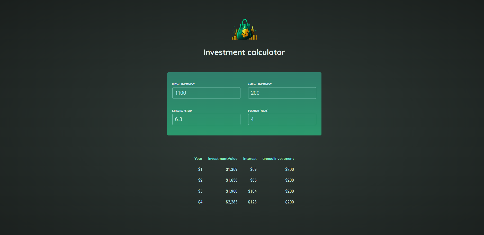

# Investment Calculator

## Description

Investment Calculator is a React-based application created as part of the Maxmillian Udemy "The Complete Guide" course. The app helps users calculate potential returns on investments based on various parameters, such as principal amount, interest rate, and investment duration.

## Features

- **Principal Input:** Enter the initial investment amount.
- **Interest Rate Input:** Specify the annual interest rate.
- **Investment Duration Input:** Set the duration of the investment in years.
- **Calculate Returns:** Compute and display the potential returns based on the inputs.
- **Interactive UI:** User-friendly interface for easy input and results display.

## Getting Started

### Prerequisites

- Node.js and npm installed on your machine.

### Installation

1. Clone the repository:

   ```bash
   git clone git@github.com:Muhammad-Ayman/investment-calculator-React.git

   ```

2. Navigate to the project directory:

   ```bash
   cd react-quiz-app

   ```

3. Install dependencies:
   ```bash
   npm install
   ```

### Running the App

1. Start the development server:

   ```bash

   npm run dev
   ```

2. Open your browser and go to http://localhost:3000.

### Screenshots


